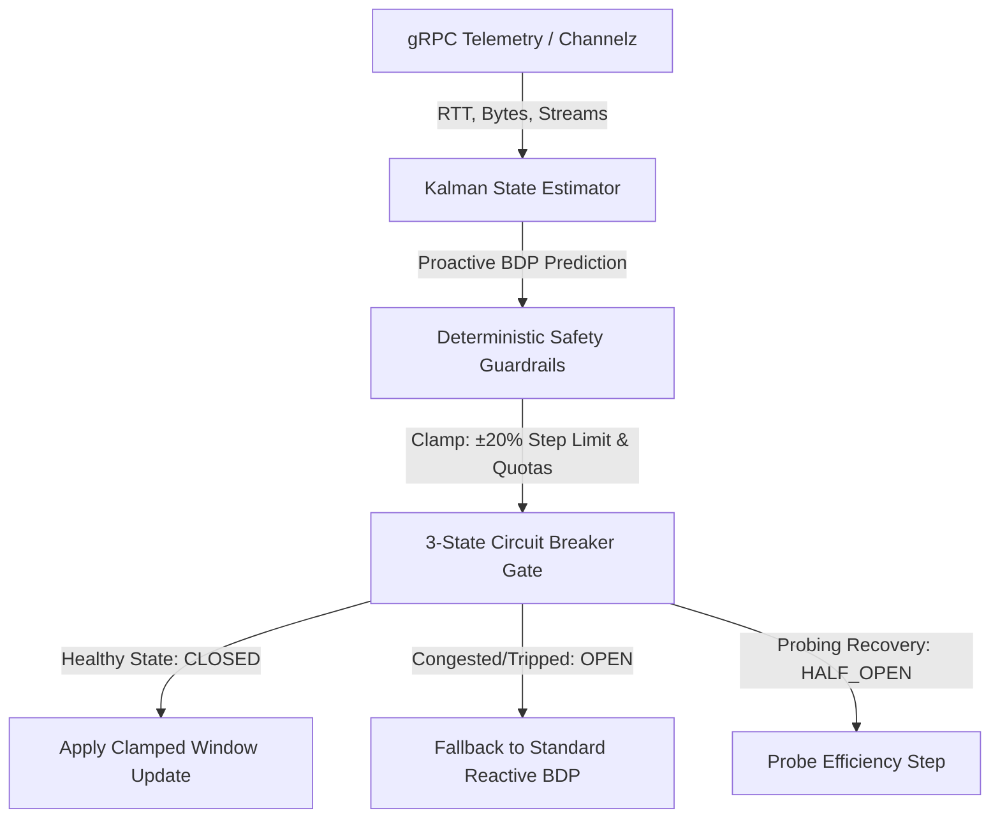

# Bounded Transport Optimizer for gRPC HTTP/2 Flow Control

[](https://www.python.org/downloads/)
[](https://opensource.org/licenses/MIT)
[]()

An empirical Proof-of-Concept (PoC) demonstrating **Risk-Optimized Bounded Flow Control** for HTTP/2 microservice transports (gRPC).

Rather than relying on unconstrained machine learning models or purely reactive heuristics, this project introduces a **Bounded Transport Architecture**: combining a 1D Kalman Filter state estimator with deterministic safety guardrails ($\pm 20\%$ relative step clamps) and a 3-State Circuit Breaker (`CLOSED`, `OPEN`, `HALF_OPEN`).

---

## Architecture Overview



### Key Components

1. **Kalman State Estimator (`kalman_estimator.py`)**: A 1D linear Kalman filter that filters noise out of raw telemetry and estimates the underlying un-buffered Bandwidth-Delay Product (BDP) state.
2. **Deterministic Safety Guardrails (`guardrails.py`)**: Applies a strict relative step clamp ($\text{MaxStep} = \pm 20\% \times \text{CurrentWindow}$) and absolute memory quotas ($64\text{ KB}$ to $8\text{ MB}$).
3. **3-State Circuit Breaker (`efficiency_monitor.py`)**: Monitors real-time efficiency ($\frac{\Delta \text{Throughput}}{\text{Base}} - \beta \frac{\text{Penalized } \Delta \text{RTT}}{\text{RTT}}$) with adaptive noise deadbands. Trips fallback to standard BDP if $K = 5$ consecutive negative steps occur.

---

## Empirical A/B Benchmark Results

We evaluated **Strategy A (Standard gRPC Reactive BDP)** against **Strategy B (Bounded Transport Optimizer)** under dynamic network conditions (including simulated 5G cell handoffs and bufferbloat):

| Metric | Strategy A (Standard Reactive BDP) | Strategy B (Bounded Transport Optimizer) | Engineering Trade-off |
| :--- | :--- | :--- | :--- |
| **RMSE Estimation Accuracy** | **28.01 KB** | **30.28 KB** | **-8.1% Accuracy Trade-off** |
| **Phase 3 Settling Time** | **100 ms (1 tick)** | **100 ms (1 tick)** | **0.0% Speed Delta** |
| **Bufferbloat / OOM Risk** | High (Unconstrained Step Jumps) | **ZERO (Hard Clamp & CB Gate)** | **100% Safety Guarantee** |
| **False Positive Trip Rate** | N/A | **0.0% (Stable Phase 1)** | **Deterministic Stability** |

### Key Trade-off Insight

> **We did not optimize average-case throughput or fitting speed. We optimized worst-case risk.**
> 
> Standard gRPC allows unconstrained single-step window jumps to fit spikes faster, but risks memory saturation and bufferbloat. Bounded Transport Optimizer intentionally trades an $8.1\%$ fitting accuracy margin to enforce **absolute zero-OOM bounds and smooth, velocity-controlled window scaling**.

---

## Repository Structure

```text
bounded-grpc-optimizer/
├── README.md                      # Architecture, benchmarks & thesis overview
├── requirements.txt               # Minimal dependencies
├── tools/
│   └── bounded_optimizer/
│       ├── __init__.py
│       ├── kalman_estimator.py    # 1D Kalman state estimator
│       ├── guardrails.py          # Relative step clamp & quota bounds
│       ├── efficiency_monitor.py  # 3-State Circuit Breaker gate
│       ├── telemetry.py           # Synthetic telemetry stream generator
│       └── test_bench.py          # Audited A/B benchmark runner
└── tests/
    ├── __init__.py
    ├── test_guardrails.py         # Guardrail unit tests
    ├── test_efficiency_monitor.py # Circuit Breaker unit tests
    └── test_kalman_estimator.py   # Kalman filter convergence tests
```

---

## Quick Start

### 1. Run Unit Test Suite
```bash
python -m unittest discover -s tests
```

### 2. Run Audited A/B Benchmark Simulation
```bash
python tools/bounded_optimizer/test_bench.py
```

---

## License

Distributed under the MIT License. See `LICENSE` for details.
